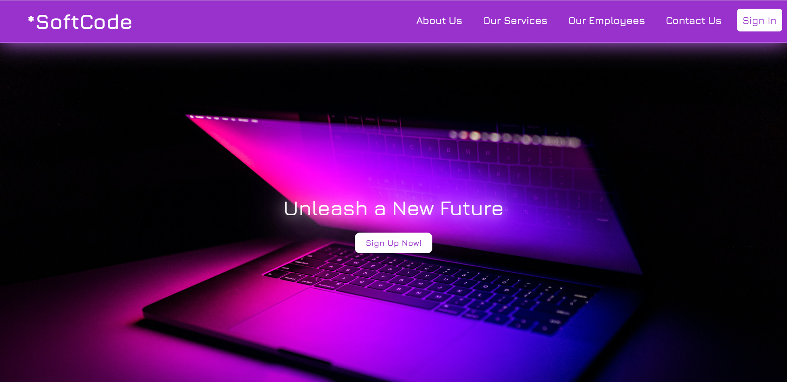

<h1>Learn full-stack website</h1>
<p>A simple website about learning full-stack development created using HTML, CSS, React, Node.js, Express, and MySQL</p>
 
# Learning Website

Welcome to the Learning Website project!A simple website about learning full-stack development. It features a front page with course listings and allows users to sign in or sign up to access the content.



## Technologies Used

- Frontend: React.js,CSS
- Backend: Node.js, Express.js
- Database: MySQL
- Authentication: JSON Web Tokens (JWT)

## Features

- **Front Page:** Browse available courses and educational materials.
- **User Authentication:** Secure sign-in and sign-up functionality.
- **User Profiles:** Create and manage user profiles.
- **Dashboard:** A personalized dashboard for users to track their progress and access saved courses.

## Getting Started

To run this project locally, follow these steps:

1. Clone the repository:
   ```
   git clone https://github.com/yourusername/learning-website.git
   ```
   ```
   cd learning-website
   ```
Install dependencies for both the frontend and backend:
for backend :
```
npm install
```
for frontend:
```
cd client
npm install
```
Set up the MySQL database:

Create a MySQL database and update the configuration in backend/config/db.js.
Start the backend server:

```
npm start
```

and then in another terminal Start the frontend development server:

```
cd client
npm start
```
Access the website at http://localhost:3000 in your web browser.
